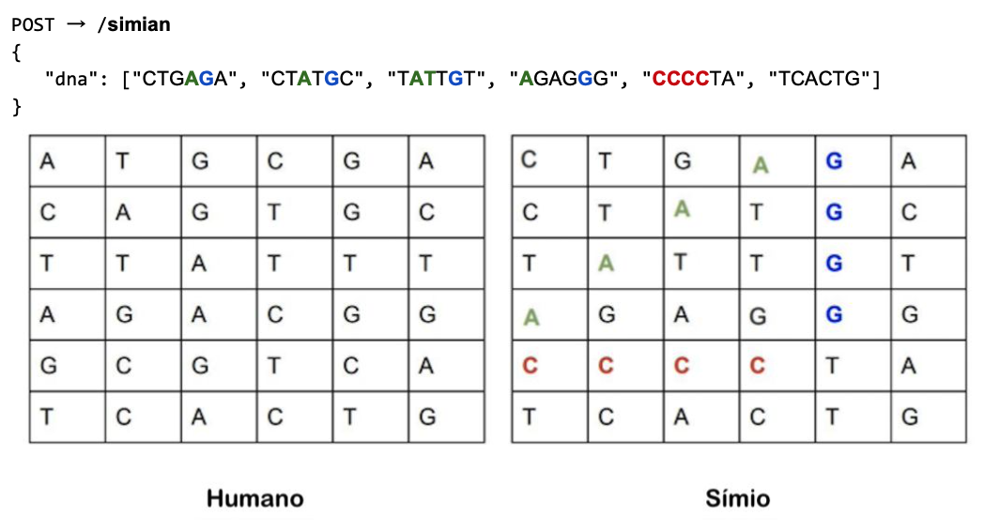

# Mercado Livre Evaluation

1. [Introdução](#introdução)
2. [Desafios](#desafios)
2. Guia de Bordo de Execução
    1. [Execute o Projeto com o Docker](#execute-o-projeto-com-docker)
    1. [Testes](#testes)
    1. [Contatos](#contatos)

## Introdução

Em um futuro distante, na cadeia de evolução, os símios e os humanos estão cada vez mais semelhantes. Por esse motivo
ficou muito difícil distinguir quem é humano e quem é símio.

Você foi contratado para desenvolver um projeto em Java, que vai identificar se uma sequência de DNA pertence a um
humano ou a um símio. O projeto consiste em desenvolver uma ***API REST***, e disponibilizar ***um endpoint HTTP POST "
/simian"***. Esse endpoint receberá como ***parâmetro***, um ***JSON*** com a sequência de DNA ***(Array de Strings)***,
onde, cada elemento desse array representa uma linha de uma tabela ***quadrada de (NxN)***, Como no exemplo abaixo:



1. Você saberá se um DNA pertence a um símio, se encontrar ***2 ou mais sequências de quatro letras iguais*** em
   qualquer direção, horizontal, vertical ou nas diagonais.

2. As letras da String ***só podem ser: (A, T, C, G)***

A ***API*** deve retornar um json com ***"is_simian": boolean***. Caso você identifique um ***símio****, deve ser ***
true***, caso identifique um ***humano***, deve ser ***falso***, como no exemplo abaixo:

```
HTTP 200
{"is_simian": true}
```

## Desafios

---
> **Nível 1:**
Desenvolva uma ***API*** que esteja de acordo com os requisitos propostos acima, que seja capaz de validar uma sequência de DNA e identificar corretamente símios e humanos.
---
> **Nível 2:**
Use um banco de dados de sua preferência para ***armazenar*** os DNAs verificados pela API. Esse banco deve garantir a unicidade, ou seja, ***apenas 1 registro por DNA***. Disponibilizar um outro ***endpoint "/stats"*** que responde um ***HTTP GET***. A resposta deve ser um Json que retorna as estatísticas de verificações de DNA, onde deve informar a ***quantidade de DNA’s símios, quantidade de DNA’s humanos, e a proporção de símios para a população humana***. Segue exemplo da resposta:
>> {"count_simian_dna": 40, "count_human_dna": 100: "ratio": 0.4}
---
> **Nível 3:**
Faça a hospedagem da ***API*** em algum ambiente de computação em nuvem ***gratuita*** (Google App Engine, Amazon AWS, etc).

## Execute o Projeto com Docker.

#### Passo 1: Certifique-se que possui o docker-compose instalado e execute o comando na raiz do projeto

```
docker-compose up -d
```

#### Passo 2: Certifique-se que possui o maven instalado e execute o comando na raiz do projeto

```
mvn spring-boot:run
```


## Testes

### Testes de unidade

Os testes de unidade podem ser encontrado no diretório /src/test. Para executá-los, acesse o diretório (raiz) e execute:

```
mvn test
```

### Testes de manuais

Certifique-se que serviço esta rodando.

##### Exemplo de payload com dna de humano

```
curl --location --request POST 'http://localhost:8080/v1/simian' --header 'Content-Type: application/json' --data-raw '{"dna": ["ATGCGA","CAGTGC","TTATTT","AGACGA","GCGTCA","TCACTG"]}'
```

##### Exemplo de payload com dna de simian

```
curl --location --request POST 'http://localhost:8080/v1/simian' --header 'Content-Type: application/json' --data-raw '{"dna": ["CTAGGTCG","TATGCATC","CAATGCTA","ATCATGAG","GTAGATCT","TTTTCAGC","CAGGTCGT","GCCCCTAG"]}'
```

### Contatos

Pedro Henrique Franco Bacchini - pedrobacchini@outlook.com